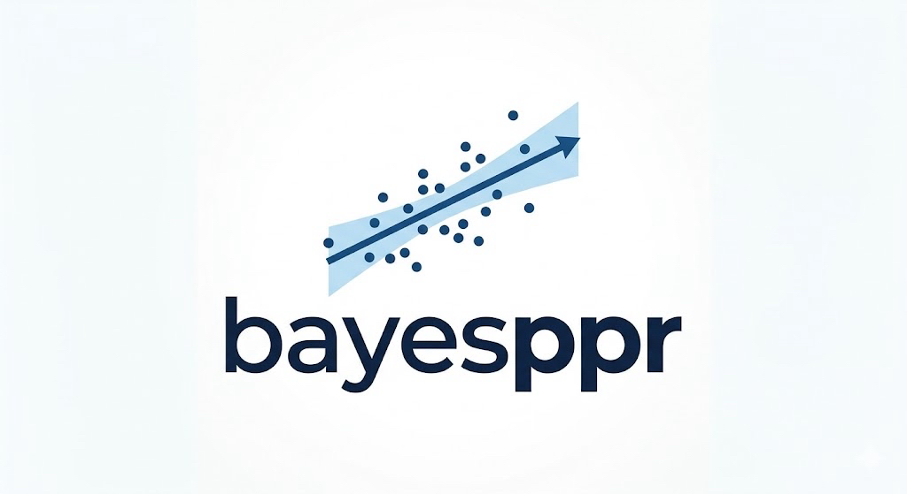

# pyBayesPPR
[](https://github.com/gqcollins/pyBayesPPR/actions/workflows/Build.yml)
[](https://badge.fury.io/py/pyBayesPPR/)



A python implementation of Bayesian Projection Pursuit Regression (BayesPPR).

## Installation
Use for pypi
```bash
pip install pyBayesPPR
```

and for latest development version
```bash
pip install git+https://github.com/gqcollins/pyBayesPPR.git
```


************

Author: Gavin Collins
